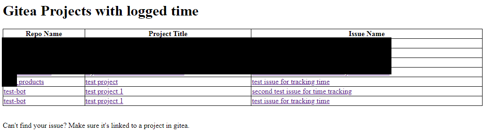
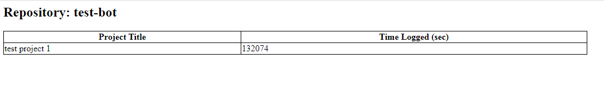
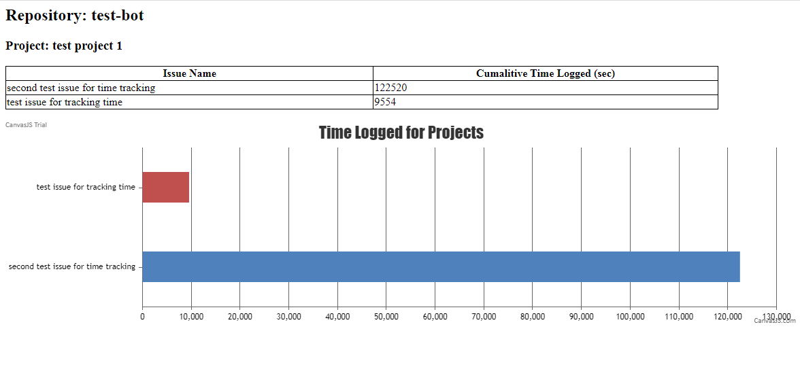
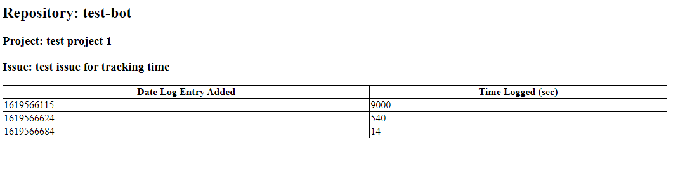

# gitea_time_tracker
A simple way to visualize time logged in gitea issues

## Contributing
This project is a work in progress.  Have improvements or changes you want to contribute? Feel free to create a branch and PR.

## Database Configuration
Create a new mysql database on your gitea instance, and create a view in that database.  This view will be used to populate all of the pages.  If an issue is not linked to a project, it will not be included.

```
CREATE VIEW time_track_view AS
select
 r.id as repo_id,
 r.name as repo_name,
 p.id as project_id,
 p.title as project_title,
 t.issue_id as issue_id,
 i.name as issue_name,
 t.time as logged_time,
 t.created_unix
from
 gitea.tracked_time t,
 gitea.issue i,
 gitea.project p,
 gitea.repository r
where t.issue_id = i.id
 and r.id = i.repo_id
 and r.id = p.repo_id
```

## index.php
This page displays a table of issues with logged time, that are linked to projects.
* Clicking on the name of a repo will take you to repo.php
* Clicking on the name of a project will take you to project.php
* Clicking on the name of an issue will take you to issue.php


## repo.php
This page displays a table of projects, and the cumaltive time logged to each of those projects for the repository selected.


## project.php
This page displays a table of issues in the project you selected that have time logged to them, along with the cumalitive time logged to each issue.  A bar graph is also shown with the same data.


## issue.php
This page displays a table of time entries that have been added to the issue you selected, along with the unix timestamp when the entry was logged.

